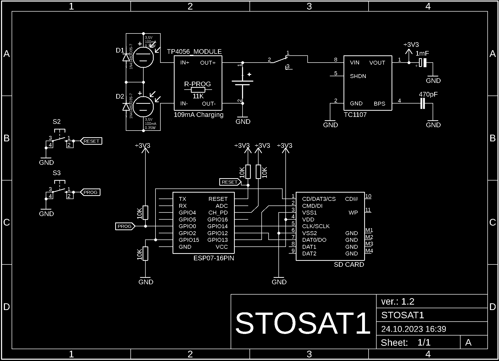

# STOSAT1
### !!The project is under development!!

**STO**-Storage **SAT**-Satellite **1**

The STOSAT1 project is a scaled down version of the CubeSat satellite, containing most of what the real cubesat does.
Solar battery charging, ESP-07 module, SDHC storage.

After firmware upload, STOSAT1 works as an FTP Server with access to SDHC storage.

## Wiring diagram
The schematic is drawn in EAGLE, [here](STOSAT1_EAGLE_2.1) is the complete EAGLE project.

## Compilation
The firmware is written in PlatformIO.

In PlatformIO I recommend to upload to ESP with the following .ini [parameters](STOSAT1_FIRMWARE/platformio.ini).

## Future plan
In the near future it is planned to add: battery voltage measurement, miniature display to show the necessary information.
